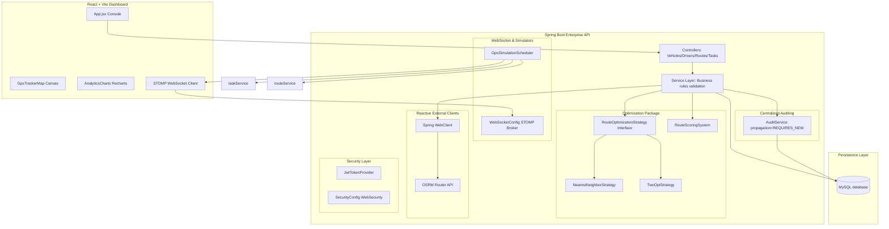
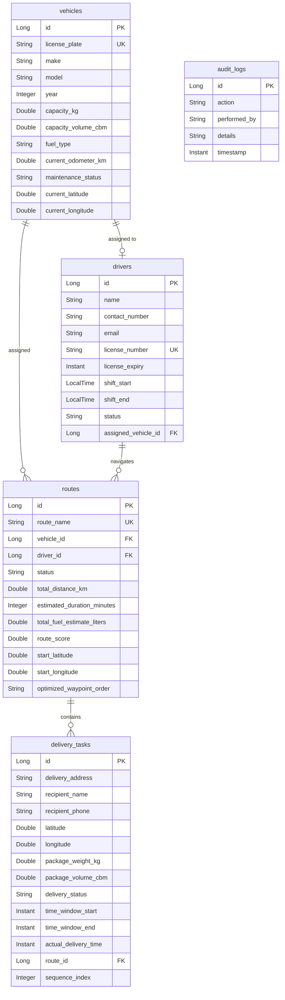

# Fleet Management and Route Optimization Engine

[](https://github.com/shriyal221/advanced-wms/actions/workflows/ci.yml)
[](https://www.oracle.com/java/technologies/javase/jdk17-archive-downloads.html)
[](https://spring.io/projects/spring-boot)
[](https://vitejs.dev)
[](https://www.docker.com/)

An enterprise-grade, high-performance fleet registry, driver scheduling, and real-time GPS-simulated route optimization system. Built using Spring Boot 3, Spring WebClient (Reactive OSRM driving matrix integration), STOMP WebSockets, and a React + Vite dashboard displaying interactive delivery paths and analytical Recharts metrics.

---

## 1. System Architecture & Patterns

The platform is designed following **Clean Architecture**, **SOLID Principles**, and **Domain-Driven Design (DDD)** principles to maximize testability, extensibility, and maintainability.



### Key Design Patterns & Upgrades:
1. **Strategy Pattern for Routing**: All TSP optimization calculations are extracted from the core service into a modular `RouteOptimizationStrategy` package, allowing pluggable execution of `NearestNeighborStrategy` and `TwoOptStrategy`.
2. **Dynamic Route Scoring System**: An evaluator (`RouteScoringSystem`) computes scores (0-100) based on weighted distance constraints, vehicle fuel consumption limits, driver shift boundaries, and simulated real-time traffic stress parameters.
3. **Reactive WebClient Port**: Fully migrated from old `RestTemplate` to modern, non-blocking Spring `WebClient`, supporting customizable timeouts and high-accuracy Haversine Fallback formulas in case OSRM is unreachable.
4. **STOMP WebSocket Real-Time Tracker**: Uses SockJS + STOMP WebSocket broker to broadcast real-time vehicle positions. An automated `GpsSimulationScheduler` tick interpolates positions and automates package states live.
5. **Propagation-Independent Auditing**: Logs critical security and operations events into the MySQL `audit_logs` table under an isolated `Propagation.REQUIRES_NEW` transaction scope.

---

## 2. Technology Stack

* **Backend**: Java 17, Spring Boot 3.3.5, Spring Security, Spring Data JPA, Spring WebFlux (`WebClient`), Spring WebSocket.
* **Database**: MySQL 8.0.
* **Frontend**: React 19, Vite, Recharts, STOMPjs, SockJS-client, TailwindCSS layout, Lucide icons.
* **Testing**: JUnit 5, Mockito, AssertJ.
* **CI/CD & DevOps**: GitHub Actions, Docker, Docker Compose, Nginx.

---

## 3. Database Schema & ERD

The backend utilizes Spring Data JPA with the following schema:



---

## 4. API Documentation: Searching, Filtering, and Pagination

All core query endpoints support database-level sorting, searching, filtering, and page limit offsets:

### Get Vehicles
`GET /api/vehicles?page=0&size=10&status=OPERATIONAL&search=Tata`
* **Query Params**:
  * `page`: Page index (default: 0)
  * `size`: Page size limit (default: 50)
  * `status`: Filter by `OPERATIONAL`, `IN_MAINTENANCE`, `SCHEDULED_MAINTENANCE`
  * `search`: Matches make, model, or plate keywords.

### Get Drivers
`GET /api/drivers?page=0&size=10&status=AVAILABLE&search=Ramesh`
* **Query Params**:
  * `status`: Filter by `AVAILABLE`, `ON_ROUTE`
  * `search`: Matches name, email, or license.

### Get Routes
`GET /api/routes?page=0&size=10&status=ACTIVE&search=RT`

---

## 5. Local Setup & Execution

### Prerequisites
* JDK 17
* Node.js 20+
* MySQL Server (or Docker running)

### Running Database (MySQL)
Create the database:
```sql
CREATE DATABASE IF NOT EXISTS fleet_db;
```

### Starting Spring Boot Backend
Configure environment variables or default values in `backend/src/main/resources/application.yml`.
```bash
cd backend
mvn spring-boot:run -Dspring-boot.run.jvmArguments="-Dspring.profiles.active=dev"
```
* Backend starts at `http://localhost:8082`
* Swagger OpenAPI: `http://localhost:8082/swagger-ui/index.html`

### Starting React Vite Frontend
```bash
cd frontend
npm install
npm run dev
```
* Open the browser at `http://localhost:5173/`

---

## 6. Docker Deployment

Deploy the entire stack with a single command:
```bash
docker-compose up --build -d
```
This starts:
1. `fleet-db` (MySQL on port 3306)
2. `fleet-backend` (Spring Boot API on port 8082)
3. `fleet-frontend` (Nginx serving React build on port 80)

---

## 7. Testing Instructions

Run backend mock unit tests verifying business validation limits and strategy transitions:
```bash
cd backend
mvn clean test
```

### Test Coverage Highlights:
* **RouteOptimizationServiceTest**: Stubbing pluggable strategy patterns, scoring systems, OSRM coordinate arrays, weight capacity boundaries, shift checks, and planned routes.
* **DriverServiceTest**: Checks license expirations, duty shift intervals, and vehicle assignment constraints.
* **VehicleServiceTest**: Verifies model-year constraints, maintenance updates, and operational boundaries.
* **DeliveryTaskServiceTest**: Tests delivery state validation (`UNASSIGNED` -> `DISPATCHED` -> `IN_TRANSIT` -> `DELIVERED`).
* **AuthenticationTest**: Asserts JWT issuer identity and role claim allocations.

---

## 8. Continuous Integration / CD

We use **GitHub Actions** for Automated CI/CD. The configuration is defined at [ci.yml](file:///.github/workflows/ci.yml):
1. **Backend Job**: Sets up JDK 17, downloads Maven packages, compiles all source classes, and executes 100% of unit tests.
2. **Frontend Job**: Sets up Node.js 20, installs dependencies via npm, and runs `npm run build` to validate Vite compilation.
3. **Docker Validation**: Evaluates Docker compose configuration parameters.
