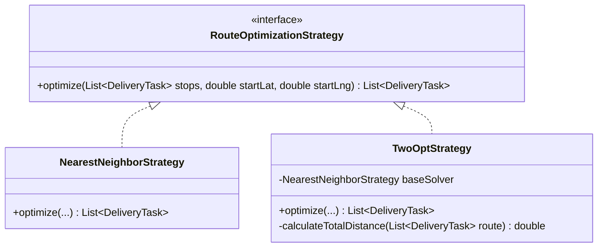
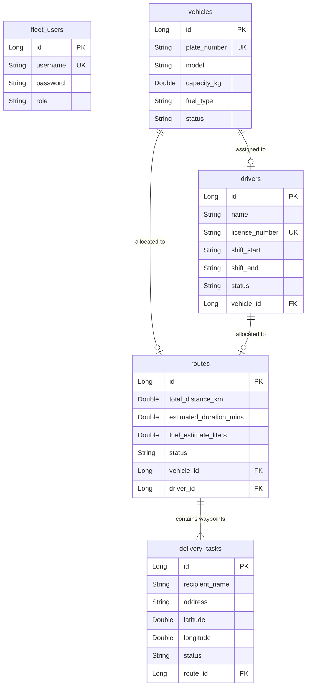

# 🏗️ HyperRoute Software Architecture & System Design Documentation

This document provides a deep-dive analysis of the system architecture, design patterns, algorithmic implementations, and database models driving the **HyperRoute Fleet Management and Route Optimization Engine**.

---

## 🏛️ High-Level Architectural Patterns

HyperRoute is designed on a clean **3-Tier Layered Architecture** with distinct separation of concerns, ensuring high maintainability, pluggability, and testability.

```
       [ React UI Dashboard (Port 5174) ]
                       │ (Stateless JSON Over REST / WebSocket STOMP)
                       ▼
 ┌────────────────────────────────────────────────────────┐
 │            Spring Boot Backend (Port 8082)             │
 │                                                        │
 │  ┌──────────────────────────────────────────────────┐  │
 │  │ Controller Layer (API Gateways & Input DTOs)     │  │
 │  └────────────────────────┬─────────────────────────┘  │
 │                           ▼                            │
 │  ┌──────────────────────────────────────────────────┐  │
 │  │ Service Layer (Business Domain Rules & Heuristics)│  │
 │  └────────────────────────┬─────────────────────────┘  │
 │                           ▼                            │
 │  ┌──────────────────────────────────────────────────┐  │
 │  │ Repository Layer (Hibernate JPA / Query Specs)   │  │
 │  └──────────────────────────────────────────────────┘  │
 └─────────────────────────────┬──────────────────────────┘
                               ▼
        [ Isolated PostgreSQL Database Schema "wms" ]
```

### Layer Responsibilities
* **Presentation Layer (Vite + React)**: Renders a modern dashboard styled using HSL-based glassmorphism CSS rules. Interacts with the backend via a stateless API connection and a STOMP WebSocket telemetry stream.
* **Controller Layer**: Handles API requests, performs input validation, coordinates mapping to DTOs, and forwards tasks to the service layer.
* **Service Layer**: House of business rules, security handling, and route optimization strategies. Completely independent of presentation frameworks.
* **Repository Layer**: Manages SQL bindings using Spring Data JPA. Exposes Hibernate-driven queries and paginated list requests.

---

## ⚡ Pluggable Route Optimization Engine Heuristics

To solve the NP-hard Traveling Salesperson Problem (TSP), HyperRoute implements a pluggable **Strategy Design Pattern** under the `com.infotact.fleet.service.optimization` package.



### 1. Nearest Neighbor Heuristic (Greedy Initialization)
* **Strategy**: `NearestNeighborStrategy.java`
* **Complexity**: $O(N^2)$
* **Concept**: Starts at the coordinates of the vehicle's depot (Home coordinates). Iteratively selects the closest unvisited delivery stop based on straight-line geodesic calculations (Haversine formula), repeating until all stops are sequenced.
* **Purpose**: Provides a fast, valid baseline route in microseconds.

### 2. 2-opt Refinement Algorithm (Local Search Optimization)
* **Strategy**: `TwoOptStrategy.java`
* **Complexity**: $O(N^2)$
* **Concept**: Refines the greedy Nearest Neighbor sequence. Selects two non-adjacent edges in the path, swaps their connection sequence (reversing the sub-segment), and evaluates whether the total path distance decreases. If a swap reduces the path distance, the change is saved and iteration continues.
* **Purpose**: Eliminates overlapping path loops (crossings), yielding routes close to the mathematical optimum.

### 3. Route Scoring & Telemetry System
The `RouteScoringSystem.java` assigns an operational score to calculated routes based on three primary factors:
$$\text{Score} = \text{Base Score (100)} - (\text{Distance Penalty}) - (\text{Capacity Penalty}) - (\text{Payload Penalty})$$
* **Payload Penalty**: Heavy cargos reduce fuel efficiency and maneuverability, decreasing the route's performance score.
* **Capacity Utilization**: Vehicles operating close to their maximum payload capacity receive a slight boost to their efficiency score, while empty trucks receive a penalty.

---

## 📡 Live Telemetry & STOMP WebSocket Flow

To support real-time vehicle GPS tracking, HyperRoute implements a STOMP WebSocket broker channel.

```
 [Client Dashboard] ─── (Subscribes to /topic/telemetry) ◄─────────┐
         │                                                        │
         ▼ (Dispatches Route)                                     │ (STOMP Broadcast)
 [REST Controller] ───► [GpsSimulationScheduler] ─────────────────┘
                             │ (Iterates waypoints every 5 seconds)
                             ▼
                    [Emit Coordinate Event]
```

1. **Broker Registration**: `WebSocketConfig.java` opens a STOMP gateway mapped to `/ws-telemetry` using SockJS.
2. **Simulation Lifecycle**: When a dispatcher marks a route as `ACTIVE`, the `GpsSimulationScheduler.java` starts a scheduled thread pooling tasks.
3. **Telemetry Streaming**: The thread calculates the straight-line progression between scheduled waypoints. Every 5 seconds, it emits a telemetry event carrying longitude, latitude, speed, and heading data, which is broadcast to all active dashboards.

---

## 🗃️ Entity Relationships & Database Model

The domain persistence layer uses isolated schema tables to manage fleet entities without resource clashes.



### Relationship Enforcements:
* **Vehicle to Driver**: A 1:1 operational linkage. Only available drivers holding active shift assignments can be assigned to operational vehicles.
* **Route to Waypoints**: A 1:N relationship. A route aggregates a list of delivery tasks ordered by their TSP optimization sequence index.
